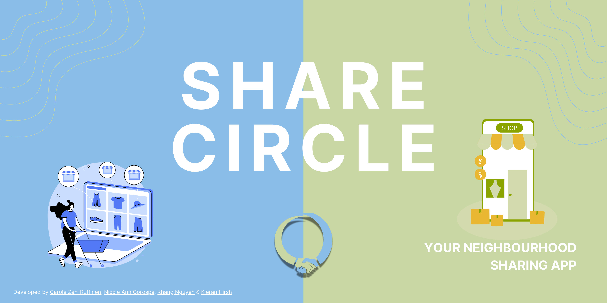
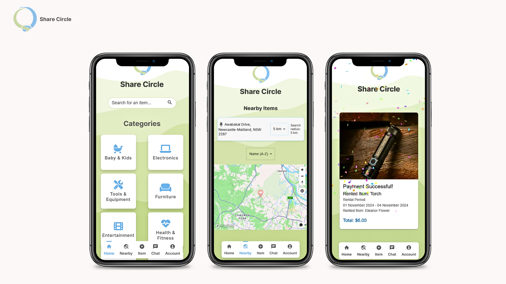

# 🌍 Share Circle



**Share Circle** is a community-driven platform that facilitates sharing and renting items within local neighbourhoods. Whether you have extra tools, furniture, or gadgets lying around, Share Circle connects you with your neighbours, fostering a sharing economy and helping you save money while reducing waste.

## 🛠 Features

- **Borrow & Lend**: Easily lend or borrow items from your neighbours.
- **User Profiles**: Manage your profile and track your borrowing and lending activity.
- **Item Categories**: Browse items based on categories like electronics, tools, household, and more.
- **Location-Based Search**: Find items available near your location.
- **Secure Transactions**: Make secure payments via Stripe. 
- **Communcation**: Communicate with your neighbours to arrange item handovers.

## 🚀 Getting Started

### Prerequisites

Ensure you have the following installed:

- **[Node.js](https://nodejs.org/en/)** (v14+)
- **[PostgreSQL](https://www.postgresql.org/)** (for database)
- **[Docker](https://www.docker.com/)** (optional, for containerized deployment)\
- **[React](https://react.dev/)** (v18.3.1)
- **[Express](https://expressjs.com/)** (v4.21.0)

### Installation

1. Clone the repository:

   ```bash
   git clone https://github.com/crlzr/Project_SC.git
   cd Project_SC
   ```

2. Install dependencies:

    ```bash
    cd frontend/my_app
    npm install
    ```

3. Set up environment variables:

    Create a .env file in the frontend/my_app directory and include the following:

    ```bash
    REACT_APP_AUTH0_DOMAIN=<YOUR OWN AUTH0 DOMAIN>
    REACT_APP_AUTH0_CLIENT_ID=<YOUR OWN AUTH0 CLIENT ID>
    REACT_APP_AUTH0_AUDIENCE=<YOUR OWN AUTH0 AUDIENCE>
    PORT=5005
    REACT_APP_MB_TOKEN=<YOUR OWN MAPBOX TOKEN>
    REACT_APP_STRIPE_PUBLIC_KEY=<YOUR OWN STRIPE KEY>
    REACT_APP_TALKJS_APP_ID=<YOUR OWN TALKJS ID>
    ```
    Create a .env file in the backend directory and include the following:
    
    ```bash
    #DATABASE_INFO
    PGDATABASE=<YOUR OWN PGDATABASE>
    PGUSER=<YOUR OWN PGUSERNAME>
    PGPASSWORD=<YOUR OWN PGPASSWORD>
    PGHOST=localhost
    PGPORT=5432
    DATABASE_URL=<YOUR OWN PGDATABASE URL>
    #SERVER_INFO
    PORT=5005
    #AUTH
    AUTH0_DOMAIN=<YOUR OWN AUTH0 DOMAIN>
    AUTH0_AUDIENCE=<YOUR OWN AUTH0 AUDIENCE>
    AUTH0_CLIENT_ID=<YOUR OWN AUTH0 CLIENT ID>
    # CLOUDINARY
    CLOUDINARY_CLOUD_NAME=<YOUR OWN CLOUDINARY NAME>
    CLOUDINARY_API_KEY=<YOUR OWN CLOUDINARY API KEY>
    CLOUDINARY_API_SECRET=<YOUR OWN CLOUDINARY API SECRET>
    #STRIPE
    STRIPE_SECRET_KEY=<YOUR OWN STRIPE KEY>
    #TALKJS
    TALKJS_APP_ID=<YOUR OWN TALKJS ID>
    ```


4. Start the PostgreSQL database:

    
    
    Import the database from the backend directory:

      ```bash
      cd backend
      psql -U <POSTGRES USERNAME> -d <POSTGRES DATABASE NAME> < database_dump.sql
      ```

5. Start the application:

    Start the backend server:
    
    ```bash
    cd backend
    node server.js
    ```
    
    Then start the frontend app:
    ```bash
    cd frontend/my_app
    npm start
    ```

6. Visit the app in your browser:

    ```bash
    http://localhost:3000
    ```


## 🧑‍💻 Technologies Used
- **Frontend:** React.js, SCSS, Mapbox API, TalkJS, Auth0, Stripe & Canvas Confetti
- **Backend:** Node.js, Express.js, JWT & Cloudinary
- **Database:** PostgreSQL & PgAdmin
- **Containerization:** Docker

## 📖 Documentation
- For detailed API documentation, visit the API Docs.

## 🛡 Security & Privacy
We value the privacy and security of our users. Share Circle follows standard security practices to protect user data and communications.

## 📬 Contact
Have any questions or suggestions? Reach out to us at sharecircle.team@gmail.com.

## :smiley_cat: :dog: :smile_cat: Developers
- [Carole Zen-Ruffinen](https://github.com/crlzr)
- [Nicole Ann Gorospe](https://github.com/NickelannG)
- [Khang Duy Nguyen](https://github.com/kdn95)

## :snail: Contributors
- [Kieran Hirsh](https://github.com/kieranhirsh)